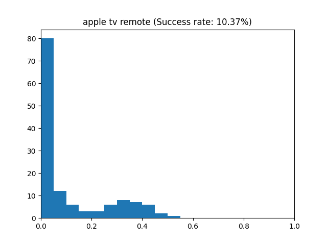
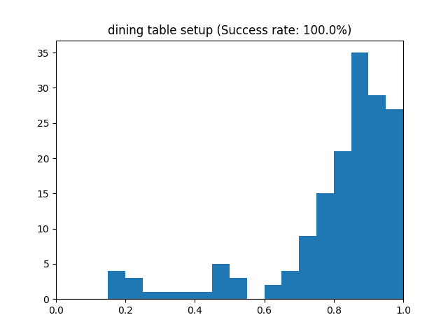

# ORBIT-CC-comparison

## Description

CLI tool to interact with and extract statistics from Azure Custom Vision API using the [ORBIT](https://github.com/microsoft/ORBIT-Dataset) dataset for comparison with an internal MS model, teachable object recogniser.

It was written during a week of work experience at Microsoft.

## Output




## Installation
The tool has been written on Linux, but should work on Windows as well, perhaps with minor changes to file handling.

### Install Python
Install python 3.10 (Other versions may work, but are not tested).

### Install dependencies with pip
```bash
$ pip3 install azure-cognitiveservices-vision-customvision pillow click
```

### Clone repository
```bash
$ git clone https://github.com/AlexAndHisScripts/ORBIT-CC-comparison.git
```

#### Setup Azure project
Create a new Custom Vision project.

Create options should be set to "Both".

#### Add Credentials

Once created, create the credentials file:
```bash
$ python comparisoncli.py gen-creds
```

In the credentials file, set:

`endpoint_training` to the endpoint of the training resource from Training Resource -> Overview -> Endpoint

`training_key` to the API key of the training resource under Training Resource -> Overview -> Manage Keys -> Key 1

`endpoint_prediction` to the endpoint of the prediction resource from Prediction Resource -> Overview -> Endpoint

`prediction_key` to the API key of the prediction resource under Prediction Resource -> Overview -> Manage Keys -> Key 1

`prediction_resource_id` to the resource ID of the prediction resource. To get this, go to [https://www.customvision.ai/projects](https://www.customvision.ai/projects) -> Settings -> Prediction

#### Add ORBIT dataset
The ORBIT dataset's validation files should be placed so that the full path is:
```
/path/to/ORBIT-CC-comparison/ORBIT-CC-comparison/data/validation/[USERS]/[DATASETS]/[VIDEOS]/[IMAGES]
```

### Usage
#### Help Menu
```bash
$ python comparisoncli.py --help
```

Full list of commands:
```
gen-creds

list-projects
create-project
delete-project

upload-images

train

list-iterations
show-iteration-status
delete-iteration
publish-iteration

process-and-export-stats

json-to-histogram

--help
```

The general order of usage is:
```bash
$ create-project --name [name]

$ upload-images
    --project-id [project-id]
    --dataset-count [Amount of datasets- recommend 12] 
    --images-per-dataset [Images for each dataset - minimum 16]
    --cluttered-filename [filename to write cluttered images to. Automatically adds .clutteredimgs file extension]
    --img-size [Size to scale images to. Recommend 224]
    
$ train-model --project-id [project-id]

$ publish-iteration
    --project-id [project-id]
    --iteration-id [iteration ID from earlier]
    --publish-iteration-name [name]
    
$ process-and-export-stats
    --project-id [project-id]
    --publish-iteration-name [name from earlier]
    --cluttered-file [full filename of cluttered images from earlier]
    --outfile [file to output JSON to]
    --amount [Total amount of images to test on, across all datasets]
    --img-size [Size to scale images to. Recommend 224]
    
$ json-to-histogram
  --infile [file to read data from - same as outfile from earlier]
  --outprefix [prefix of output images]
```

### Final note
If the iteration is published, you need to unpublish it in the web dashboard ([https://www.customvision.ai/projects](https://www.customvision.ai/projects)) before removing it in the CLI.